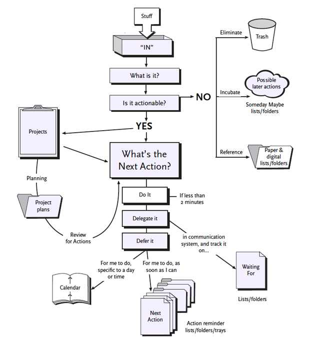

# Task GTD

## Dependency

- [Taskwarrior]()
- [html-xml-utils]()

```
brew update
brew install taskwarrior
brew install html-xml-utils
```

This plugin use [this article](https://taskwarrior.org/news/news.20150627.html) from : Tom Sydney Kerckhove (see below for a transcription of it)

## GTD with Taskwarrior, Part 1: [Intro](http://cs-syd.eu/posts/2015-06-14-gtd-with-taskwarrior-part-1-intro.html)

This is the first post in a series where I’m going to show you how I use taskwarrior to implement GTD. I would like to put up a guide that shows how to use taskwarrior to GTD in great detail, as well as make a record of my usage for personal recollection.

This entire series assumes that you at least know what GTD is. If you have no clue what GTD is, you can check out the blogpost GTD in 15 minutes – A Pragmatic Guide to Getting Things Done, or just read the book, of course. The series focuses on implementing GTD, not explaining GTD, but you might be able to follow if you don’t feel the need to know why I do this.

In this post, I will show you what taskwarrior is, how to get it and the basics of using it. Please note: If you want to replicate this system, you will have to be familiar with using a terminal.

### An intro to Taskwarrior

Taskwarrior is a free and open-source, command-line, task management program with options for synchronisation, automation and optimisation. I think you can already see why I use this and why I would recommend using it. There is a more extensive list on the taskwarrior website of reasons to use taskwarrior, but I think I’ve made my point.

A Taskwarrior system can be viewed as a giant list of all your tasks. Taskwarrior’s strength comes in the abundancy of ways to view, create, update and check off these tasks. In a way, it’s just a very efficient list manager.

### Getting Taskwarrior

Taskwarrior’s task is a package in most Linux distributions. I would recommend cloning the git repository and compiling the program from source, so as to get the latest version. (Taskwarrior is still very much under development)

More details on how to get Taskwarrior can be found on the website as well. For me, installing task was as easy as running:

```
$ sudo pacman -S task
```

### The basics

You can read the entire manual page for taskwarrior (man task), but it’s probably easier to learn as you use the system. The main concept to retain is that a task command is always of the same form:
```
                      $ task <filter> <command-name> <arguments>
```
The <command-name> part is obvious: You select which functionality you would use: add done list, etc… A task command, by default, is run on all your tasks, but you use the filter part of the command to filter out the tasks that you want to run the command on. The <arguments> part is different for every command, but you will get the hang of that soon.

The basic commands that you have to understand before you can start using your shiny new system are next, add and done. Try running task right now. You should see something like this:
```
$ task

[task next]
No matches.
```
Taskwarrior runs task next by default when you run task task next shows you a list of your most urgent tasks. A number of factors are used to determine urgency of a task. For now, just assume that Taskwarrior knows what’s best for you. You will probably use this command most often.

Adding tasks is very easy:
```
$ task add Read chapter 1 of GTD
Created task 1.
```
Tadaah, you’ve created your first task. Each task has an ID, this one has ID number 1.

Now, because you’re using GTD, you will want to add the task to a project. You do this by adding project:read.gtd to the command. Because Taskwarrior is made for efficiency, you can shorten project to any unique prefix, so you can also use pro:read.gtd. Taskwarrior also allows you to tag tasks. You add a tag to a task with a +<tag> argument.

In full, you would use something like this:
```
                      $ task add Read chapter 1 of GTD pro:read.gtd +read +@home
```                      
Lastly, you need to be able to check off tasks. Remember that each task has an ID? You use that ID as a filter when you done a task.
```
$ task 1 done
```
This way, you can check off multiple tasks at once by enumerating them in a comma-separated list 1,3,8,71 or a contiguous set 1-5, or both: 1,5-10,12.

There, now you know the absolute basics. If you want to read more on how to use taskwarrior, I suggest you read the 30-Second Tutorial on their website and the Best Practices.

Defines aliases and facilities to use taskwarrior as GTD tool

## GTD with Taskwarrior, Part 2: [Collection](http://cs-syd.eu/posts/2015-06-21-gtd-with-taskwarrior-part-2-collection.html)

In the second part of this series on how to use Taskwarrior to implement GTD, I will show you the first step of GTD: collection.

Collection allows you to capture ‘stuff’ and thereby freeing up your mind to do what it’s good at: creative thinking.

### Collection requirements

Let’s look at the requirements of GTD’s collection:

The inbox is where you capture ideas and tasks as they occur to you.
The transaction cost of putting something in your inbox should be as low as possible.
If your inbox is not at zero, it has to be immediately visible.
You should need as few inboxes as possible.
Taskwarrior inbox

An item in your inbox is really just a “this-needs-to-be-processed-item”. As such, it is something that you need to do with the added semantics that it’s just a decision. There is no reason why Taskwarrior can’t also be your inbox given that it’s used correctly.

You can’t just add inbox-items to Taskwarrior just like you would add normal tasks. That would ruin the concept of an inbox as well as the rest of Taskwarrior. This needs to be handled with a little more care.

### Adding ‘stuff’

We need to make it very easy to add an item to our inbox. I do this with an alias. The following line is in my aliases file.
```
alias in='task add +in'
```

Note that the +in tag is used to add the semantics of an inbox item to the task.

Now, when you want to add an inbox item, you just type in:
```
$ in Set up meeting with Dave
```

That’s two letters instead of twelve. You could bring it down to one, of course.

### Ever-present stuff

We can now make use of the +in tag, by making sure that the +in tasks show up exactly when we need them to.

You need a way to see how may tasks are in you inbox. There are two ways to do this. You can use Taskwarrior’s built-in urgency system to have in tasks show up in your next report, or you can have the number of tasks in your inbox show up in you terminal’s prompt.

### Urgency

To add urgency to an in task, we modify its urgency coefficient. You can do this by putting the following line in your ~/.taskrc file:
```
urgency.user.tag.in.coefficient=15.0
```
I usually recommend against this because it will clutter your next report later.

### Inbox in terminal’s prompt

To add a the number of inbox items to your terminal’s prompt, you can modify the PS1 environment variable. You can add this to your shell’s ‘.rc’ file:
```
export PS1='$(task +in +PENDING count) '$PS1
```
Mind the single quotes. Now your shell’s prompt will say how many tasks are in your inbox.

### Report

Later, when you will process your inbox, you will need to see it. I have made a custom report to view my inbox. You can configure it by putting the following lines in you ~/.taskrc file.
```
report.in.columns           = id,description
report.in.description       = Inbox
report.in.filter            = status:pending limit:page (+in)
report.in.labels            = ID,Description
```

To see this report, just type task in. It is a very minimal report, perfect for processing.

We will go into processing your inbox in later parts. For now, just try to adopt the habit of using your fancy new inbox to dump all your mental “stuff”.

## GTD with Taskwarrior, Part 3: [Tickling](http://cs-syd.eu/posts/2015-06-28-gtd-with-taskwarrior-part-3-tickling.html)

In the third part of this series on how to use Taskwarrior to implement GTD, I will show you the third step of GTD: Using a tickler file.

A tickler file system is usually implemented using 43 file folders. 31 for the days of the month and 12 for the months of the year. Every day you open the folder for that day and receive the ‘stuff’ in your inbox.

I personally like a paper-based tickler file but Taskwarrior seems particularly well equipped to handler a digital tickler file.

### Tickler file requirements

Tickle items should only be visible on (and after) the day you need to see them.
For every tickle item, you should know why you get it in your inbox (again).
For every tickle item, you should know when you put it in your tickler system.
The transaction cost of using a tickler system should be as low as possible.
Tickler file with Taskwarrior

Remember that a tickle item is something that has to end up in your inbox at a very specific time. When implementing a tickler system digitally this can be done much easier than using 43 file folders that you check every day. Your computer can check your tickler file for you and just put it in your inbox again. This way you don’t even need to develop a habit, which we all know is hard work.

Adding wait: metadata to a task ensures that the task won’t be visible until the date that you set this metadata to. For example, when you enter the following command, the task doesn’t show up until the following Sunday:
```
task +in wait:sunday Remind Dave to water his plants.
```
Of course we will use an alias to do this more easily. We used an in alias to add ‘stuff’ to your inbox. Tickle items are also ‘stuff’, so we are going to use that in alias in the definition of the tick alias.

```
tickle () {
    deadline=$1
    shift
    in +tickle wait:$deadline $@
}
alias tick=tickle
```
This tick alias allows you to add new tickle items by entering something like this into your terminal.
```
tick monday Put the office plants into the sunlight
```
This way the task will only show up in your inbox the following monday. Of course you can also use full dates like 2015-06-30.

### Thinking it over

Personally, I often encounter a situation where I need to think something over and decide what to do with it later. This really doesn’t have to end up on a task list because then there’s the possibility that I’ll see it before I’m ready to think about it. For precisely that situation, I made the think alias:
```
alias think='tickle +1d'
```
It is important that you don’t ever think something over twice. You don’t want to create a snooze button! A good practical tip is to make sure that every think item is a simple yes/no question.

## GTD with Taskwarrior, part 4: [Processing](http://cs-syd.eu/posts/2015-07-05-gtd-with-taskwarrior-part-4-processing.html)

In the fourth part of this series on how to use Taskwarrior to implement GTD, I will show you the fourth step of GTD: processing your ‘stuff’. This is where the real heavy-on-brainpower work comes in.

Every ‘in’ item should be processed by following this flowchart:



That is at least the idea.

### Processing requirements

Processing your inbox should be very easy to start with.
Processing is about making decisions, not about starting or finishing tasks.

### Processing with Taskwarrior

To start processing your inbox, type task in. You should now see your inbox items if you’ve followed this series up to this point. For every task you see there, go over the following questionnaire.

Decide whether the item is actionable.

- *It’s not*: Decide whether to keep note of it in your reference system, whether you want think it over of just delete it. (Remember, when using think, you should enter a simple yes/no question.) Then check off the task.
- *It is*: go on.

Is there more than one action required?

- Yes: Start up a new project. Figure out the desired outcome for the project and add the first ```+next``` action to it: Don’t forget to add the ```+next``` tag.

  ```
  task add +next pro:new.project "Set up a new git repository for the fancy new project"
  ```
  Also add as many tasks as you can possibly think of for this project. Then check off the task.

- No: Decide what action the ```+in``` task represents and go on. Decide how long the action is going to take.

  - It will take no longer than two minutes: Do it right now. Then check off the task.
  - It will take longer than two minutes: Estimate how long it would take to complete the action and go on.
  - Are you going to delegate the task?

    - Yes: Modify the task to be a waiting task and annotate it with instructions on how to check whether the task is done yet. Then delegate the task. Let’s say the task has ID n.
    ```
    task n modify -in +waiting
    task n annotate "Check: Call Dave and ask about the car tires." due:+1w wait:+1d
    ```
    I added ```due:+1w```, which means that Dave has a hard deadline of one week to complete this task and wait:+3d, which means that I can’t see this task until tomorrow so that I won’t pester Dave about it until at least three days from now.

    - No: Go on.
    Defer the task
    You know which project the task belongs to. Add your task to that project. If it’s the next action for that project, don’t forget to add the +next tag and check the in task.
    ```
    task n done
    task pro:gtd add Call Jamie to schedule a meeting.
    ```

Make sure the action is really an action. It must be something that you can start doing immediately without thinking about “how?”, “where?” or “why?” thanks to the thought you put into it at this moment.

When you get into the habit of asking yourself these questions, there should come a point where you don’t need the flowchart anymore.

### Contexts

Later, when you finally get around to doing, it will be very important for your mental health to keep in mind the context in which you are working. Luckily, Taskwarrior makes it very easy to allow you to use your context to your advantage. For now, all you need to remember is to always add at least one context tag to a tag. Common context tags are ```+@office```, ```+@phone```, ```+@computer```, ```+@online```, ```…````

It might not look like it, but this is actually very important. I would argue it’s the most important meta-data on your tasks.

### Advanced Applied Laziness

#### Research

Often the very next task for a project is just a whole lot of ‘looking into something’. For that reason, here is the rnd alias:
```
alias rnd='task add +rnd'
```
Because, for me, looking into something always means looking it up on the internet, I add ```+@computer``` and ```+@online``` to the alias. Moreover, it’s always a next action as well:
```
alias rnd='task add +rnd +next +@computer +@online'
```

#### Read and review

Reading something later, when you know very well what it is you want to read is called ‘read and review’. Ideally, you know exactly what you need to do, which drawer you need to open, which file to open, which link to point your browser to,…
Taskwarrior allows you to keep this info in annotation with task annotate.

For me, read and review always happens on the internet. Enter the rnr alias:
```
webpage_title (){
    wget -qO- "$*" | hxselect -s '\n' -c  'title' 2>/dev/null
}

read_and_review (){
    link="$1"
    title=$(webpage_title $link)
    echo $title
    descr="\"Read and review: $title\""
    id=$(task add +next +rnr "$descr" | sed -n 's/Created task \(.*\)./\1/p')
    task "$id" annotate "$link"
}

alias rnr=read_and_review
```

If you’re not into figuring out what bash code does: Entering the following command into your shell will result in a new task with a ```+rnr``` tag with description ‘GTD with Taskwarrior, part 4: Processing’ and the link as an annotation.

```
rnr http://cs-syd.eu/posts/2015-07-05-gtd-with-taskwarrior-part-4-processing.html
```
Oh, and you might need to install ```html-xml-utils```

## GTD with Taskwarrior, part 5: [Doing](http://cs-syd.eu/posts/2015-07-12-gtd-with-taskwarrior-part-5-doing.html)

This fifth part of the series on how to use Taskwarrior to implement GTD is on the most important part of productivity: Doing your work.

Up until now, how have you been deciding what to do? Even if you knew what to do, how did you know there’s nothing better for you to do at that moment?

GTD offers you a concrete method to make informed decision on what to do when you work.

1. Have everything you know you’ve decided you need to do ready to evaluate.
* Narrow down the amount of tasks to choose between as much as possible.

### Context

The most important step in choosing what task to work on is to realise that there are tasks you don’t even need to consider. If you’re on an airplane and you have some time to work, there’s absolutely no way that you’re going to be able to water your office plants. Ideally, tasks that lie out of your current context should not even present themselves in the range of opportunities.

Taskwarrior makes this part very easy.

Remember that in the last part I told you to add a context tag to every task? Now we’re going to use them.

First, Identify the different contexts that you work in. For example, at work I’m always at a computer connected to the internet with a phone next to me, so the ```+@computer```, ```+@phone``` and ```+@online``` tags go together:

```
context.work=+@computer or +@phone or +@online
```
At home, I currently have no internet connection:

```
context.home=+@home -@online
```
This might not be the most practical example but you get the idea.

Because you’ve already tagged all your tasks, setting a context takes care of the rest:

```
task context home # At home
task context work # At work
```

Now Taskwarrior will no longer show any tasks that are not available to work on in your current context.

Note that I’m assuming that you’ve either synchronized Taskwarrior across your home- and work computer, or you’re using a laptop.

### More narrowing down

You can take the ‘narrowing down the options’ step of GTD down a lot further than just contexts. Be wary however, this could increase the transaction cost of using your system if you’re not careful.

#### Brain power

Here’s another example. You’ve just done an exam and your brain feels like it’s toast. There’s no use in seeing a task like Write a review of Marc's paper on monoids in the category of endofunctors (wink). A task like Water the office plants would ideally present itself at the top of your task list.

You can use Taskwarrior’s used defined attributes (UDA) to accomplish this.

Start by defining a UDA for brainpower:

```
uda.brainpower.type=string
uda.brainpower.label=Brainpower
uda.brainpower.values=H,M,L
uda.brainpower.default=M
```

You can omit the default value if you’d rather be sure to enter it yourself. If you end up with a task without a brainpower attribute, it’s possible that you might run into some sorting problems later.

You can then add the brainpower consideration to your next report:

```
report.next.description     = Most urgent tasks
report.next.columns         = id, start.age, entry.age, urgency, depends, priority, project,tags, recur, scheduled.countdown, due.remaining, until.remaining, description, brainpower
report.next.filter          = status:pending and +next
report.next.labels          = ID,Active,Age,Urgency,Deps,P,Project,Tag,Recur,S,Due,Until,Description,Brainpower
report.next.sort            = brainpower-,priority-,urgency-
```

This will sort the tasks on your list in a decreasing order by brainpower first.

#### Estimate

Similar to the way we define the brainpower UDA, you can also define a UDA for the time estimated to complete the task:

```
uda.estimate.type=numeric
uda.estimate.label=Estimate
```

You could define a default for the estimate as well but I’d recommend against that. There’s no good default value for a task anyway. This does mean that you have to specify an estimate for every task.

I’ll leave it to you to extend your next report to include an estimate.

#### Using your UDA’s

To create a new task, you now specify a brainpower and an estimate:

```
task add "Call Jamie and ask him why my office plants were dead after my holiday weekend." es:5 brain:L
```
To evaluate what task you should work on next, assess the state of mind you are in and estimate the amount of time you have right now. Let’s say you’re ready to do some heavy-on-brainpower work but have only 10 minutes before your next meeting starts:

```
task next brainpower:H estimate:10
```

The next report should now show you a significantly smaller amount of tasks to choose from. Even better, you are sure that you only see tasks that you can actually make progress on within the next ten minutes.


Authors
-------

*The authors of this module should be contacted by mail

  - [Enoch Root](mailto://m.enochroot@gmail.com)
